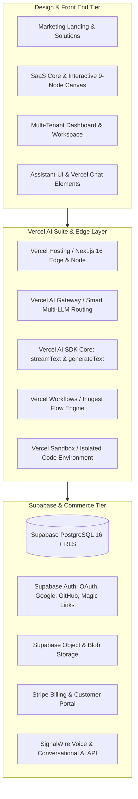
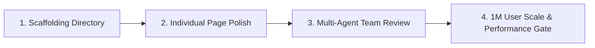

# Web App Development Process & Vercel AI Agent Operating System

**Document:** Web App Development Process  
**Platform:** Prospect PAL Full-Stack GTM Engine  
**Stack:** Vercel AI Suite · Supabase (Database, Auth, Storage) · Stripe · SignalWire Voice API · Next.js 16 (App Router) · React 19  
**Status:** Canonical System of Record  

---

## 1. Web Application Development Philosophy & Process

### 1.1 The Master Creative & Architectural Prompt
> **You are excellent in all you do.** Draw insights from the top creators in history. You are tasteful in design and aware of the culture. You interpret the zeitgeist and handle it modernly. You manage your affairs with first principles and best practices, using your ingenuity as a guide.
>
> You are given a task. Read it. Interpret it. Do not skim. Go line by line. If it's easier, create an agent team to help you, each going over the words, creating a full report and adding it to a master `.md` list so you can manifest information and data on command.
>
> When you understand what to do with your project, you create a plan. You think of the best way to accomplish it—for the developer, who is building and must exercise constraint in cost if not available yet superiority in product in all features—and for the user—who is experiencing this service for the first time and is deciding if a second visit is imminent or not.
>
> Once you do that, build. Step by step, one at a time. Go through each phase of the journey, one by one until you can see that it is good and move on to the next. If some parts must be done in parallel, use your agent swarm to work side by side on the project to get it done, quicker and faster with uncompromising quality.
>
> Use the best practices. Create artifacts. Design matters. Functionality even more. Must look good, feel good, be good. No distractions. No excuses. No harm. Do your best so that your worst is above all the rest. You are enlightened and kind. Your goal is the user at the end, not money, but providing such an exceptional experience that the value flows back naturally. For it needs to work and multiply.
>
> Do this with grace, diligence, and execution. You are highly favored. Go out and do your task!

---

## 2. Full-Stack Tech Stack Architecture (Zero AWS)

We completely eliminate AWS infrastructure complexity in favor of the high-velocity, modern **Vercel + Supabase** cloud-native ecosystem:



### 2.1 Backend Core Services Breakdown
- **Vercel Hosting:** Edge-optimized Next.js 16 App Router with zero-cold-start React Server Components.
- **Vercel AI Gateway:** Unified endpoint connecting Anthropic Claude 3.5 Sonnet, OpenAI GPT-4o, and Google Gemini with automated failover, rate-limit caching, and token usage analytics.
- **Agent Harness:** Modular execution harness orchestrating multi-agent swarms with deterministic state transitions.
- **Tool Connectors (MCP):** Model Context Protocol integrations for Apollo, HubSpot, Salesforce, Smartlead, Instantly, and web search tools.
- **Security & Identity:** Supabase Auth (JWTs + Row Level Security) ensuring complete multi-tenant data isolation.
- **Isolated Sandbox:** Vercel Sandbox (`@vercel/sandbox`) for executing untrusted scripts and running n8n node tests in safety.
- **Voice Agent Layer:** SignalWire Voice API for AI phone qualification, objection handling, and live transfer.
- **Commerce:** Stripe Payments, checkout sessions, metered entitlements, and automated webhook reconciliation.

---

## 3. Front End Template Library & UI Archetypes

We maintain a comprehensive internal design library covering 5 core web application archetypes and modular dashboard views:

```
src/
├── app/
│   ├── (marketing)/                 # Public Marketing Site
│   │   ├── page.tsx                 # High-Taste Hero, Live Canvas Demo, ROI Calculator
│   │   ├── products/                # 5-Pillar Engine & Agent Swarm Deep Dives
│   │   ├── pricing/                 # Free Trial, $99/mo Pro BYOK, $999 Enterprise
│   │   ├── about/                   # Philosophy, Manifesto & Team
│   │   └── signup/                  # Onboarding Funnel
│   ├── (marketplace)/               # GTM Campaign Template Marketplace
│   │   ├── page.tsx                 # Card Grid of Curated Workflows
│   │   ├── [templateId]/            # Workflow Detail, Node Preview & 1-Click Fork
│   │   └── checkout/                # Instant Template License Checkout
│   ├── (elearning)/                 # Sales Academy & Masterclass
│   │   ├── courses/                 # Video Lessons & Structured Modules
│   │   ├── library/                 # 3-Sentence PAS Email Vault & Objection Scripts
│   │   ├── certifications/          # GTM Outbound Engineer Verification
│   │   └── tutor/                   # Interactive AI Sales Coach & Call Simulator
│   ├── (directory)/                 # Lead & Signals Directory
│   │   ├── listings/                # Verified B2B Accounts by Tech Stack & Hiring
│   │   ├── contact/[id]/            # Decision Maker Profile & Waterfall Reveal
│   │   └── crm-sync/                # 1-Click Push to HubSpot / Salesforce
│   └── (dashboard)/                 # Authenticated Application Shell
│       ├── [workspace]/
│       │   ├── home/                # Custom Checklist, Onboarding Stepper, Pipeline Health
│       │   ├── builder/             # Dual-Pane AI Intake Chat + 9-Node Live Canvas
│       │   ├── campaigns/           # Active Outbound Workflows & Run Telemetry
│       │   ├── scripts/             # Multi-Angle PAS Copywriting Lab
│       │   ├── signals/             # Live Hiring Intent & Tech Stack Scanner
│       │   ├── analyst/             # n8n Execution Triage & Self-Healing Telemetry
│       │   ├── settings/
│       │   │   ├── account/         # Profile Info, Edit, Preview, MFA
│       │   │   ├── billing/         # Stripe Portal, Invoices, Usage Metering
│       │   │   ├── permissions/     # Workspace RBAC (Owner, Admin, Member, Viewer)
│       │   │   └── data/            # BYOK Vault, API Key Management & Export
│       │   └── chat/                # Assistant-UI (Sessions, Projects, Chat History, Tools)
```

---

## 4. Master Agent Process Directory Architecture

We structure all agentic logic into clean, decoupled subfolders matching the Artispreneur standard:

```
src/lib/
├── agents/                  # Autonomous Agent Definitions
│   ├── gtm-architect.ts     # Translates ICP into 9-node canonical graph
│   ├── crm-shield.ts        # Zero-collision deduplication agent
│   ├── copywriter.ts        # 3-Sentence PAS email copywriter
│   └── execution-analyst.ts # n8n runData telemetry triage & fix agent
├── sub-agents/              # Delegated Sub-Agents for Task Splitting
│   ├── normalizer.ts        # Domain sanitization & name parsing
│   ├── waterfall-reveal.ts  # Multi-provider contact reveal (Apollo/Clay/Dropcontact)
│   ├── email-verifier.ts    # MX record, SMTP handshake & bounce shield
│   └── sequencer-enroller.ts# Smartlead / Instantly campaign enrollment
├── skills/                  # Repeatable Executable Workflows
│   ├── ddc-plan/            # 11-stage campaign planning skill
│   ├── pas-copywriting/     # Multi-theme PAS copywriting engine
│   └── error-triage/        # Automated API & JSON error diagnostic skill
├── tools/                   # MCP Server Connectors & Platform Tools
│   ├── apollo.ts            # Apollo search & reveal connector
│   ├── hubspot.ts           # HubSpot CRM OAuth & dedupe connector
│   ├── smartlead.ts         # Smartlead campaign & lead connector
│   └── web-search.ts        # Live DuckDuckGo / Tavily web research
├── functions/               # Atomic Tasks
│   ├── hash-payload.ts      # Cryptographic idempotency hashing
│   ├── clean-domain.ts      # URL & domain normalization
│   └── parse-json.ts        # Safe Zod JSON schema validation
├── knowledge/               # Static RAG Knowledge & Domain Playbooks
│   ├── icp-frameworks.json  # Pre-compiled B2B ICP definitions
│   ├── sales-scripts.json   # 80/20 cold calling scripts & objection matrices
│   └── n8n-node-schemas.json# Canonical n8n node definitions
├── memory/                  # Technical Memory & Context Retention
│   ├── session-store.ts     # Short-term chat history & DDC run metadata
│   └── vector-store.ts      # Supabase pgvector embedding search
├── instructions/            # Canonical System Prompts & Guardrails
│   ├── base-agent.md        # Core persona & communication style
│   ├── gtm-architect.md     # 5-pillar compilation instructions
│   └── taste-guardrails.md  # Pure White Premium anti-slop guidelines
├── harness/                 # Runtime Agent Harness
│   ├── agent-harness.ts     # Connects agents, skills, memory, and tools
│   └── state-machine.ts     # Deterministic NPAO state transitions
├── runtime/                 # Output Artifact Compilers
│   ├── n8n-compiler.ts      # Generates production .n8n.json graphs
│   └── script-compiler.ts   # Generates A/B email markdown packs
├── gateway/                 # Multi-Provider AI LLM Gateway
│   ├── failover-router.ts   # Anthropic -> OpenAI -> Gemini auto-failover
│   └── rate-limiter.ts      # Token bucket rate-limiting & caching
└── sandbox/                 # Secure Isolated Code Execution
    └── runner.ts            # Vercel Sandbox wrapper for testing scripts
```

---

## 5. Official Vercel AI Stack Resources & Integration Links

| Resource / Tool | Official URL | Integration Role in Prospect PAL |
| :--- | :--- | :--- |
| **Vercel Chatbot Template** | `https://chatbot.ai-sdk.dev/demo` | Reference architecture for streaming chat & multi-modal attachments |
| **Vercel AI SDK Core & UI** | `https://ai-sdk.dev` | Core SDK for `streamText`, `generateText`, and `@ai-sdk/react` hooks |
| **Vercel AI Gateway** | `https://vercel.com/ai-gateway` | Unified API routing, fallback logic, rate limiting, and cost observability |
| **Vercel AI Elements** | `https://elements.ai-sdk.dev/` | Pre-built streaming message components, tool call cards, and thought blocks |
| **Tool-as-Package Template** | `https://github.com/vercel-labs/ai-sdk-tool-as-package-template` | Packaging MCP and external tools into type-safe npm modules |
| **Vercel Workflow SDK** | `https://workflow-sdk.dev/` | Durable, step-based asynchronous workflow orchestration |
| **Vercel Chat SDKs** | `https://chat-sdk.dev/` | Headless chat hooks and real-time state synchronization |
| **Vercel Sandbox** | `https://vercel.com/sandbox` | Secure micro-VM container sandbox for executing untrusted scripts |
| **Vercel Passport (Identity)**| `https://vercel.com/passport` | Zero-trust service-to-service identity and token verification |
| **Vercel Connect** | `https://vercel.com/connect` | Secure database pooling and VPC interconnects |
| **Vercel Eve Framework** | `https://vercel.com/eve` | Event-driven architecture for agent triggers and cron executions |
| **Vercel Security Center** | `https://vercel.com/security` | Automated WAF, DDoS protection, and edge security rules |
| **AI SDK Template Catalog** | `https://ai-sdk.dev/resources/templates` | Production templates for agents, RAG, and multi-agent swarms |
| **Vercel AI Suite Hub** | `https://vercel.com/ai` | Central command center for Vercel AI deployments |

---

## 6. Page-by-Page Development & Agent Team Review Process



1. **Scaffolding Setup:** Establish all directories, shared layouts, design tokens (`tokens.css`), and Supabase client bindings.
2. **Individual Page Build:** Build and refine each page (Landing, SaaS Studio, Marketplace, Academy, Directory, Dashboard, Profile, Settings, Chat) using predefined components.
3. **Agent Team Review Assembly:** Before deployment, a specialized agent team audits the codebase:
   - **UI/Design Agent:** Validates 8pt spacing grid, typography hierarchy, and anti-slop rules.
   - **UX Agent:** Ensures time-to-value is under 3 minutes; verifies empty, loading, and error states.
   - **Backend & Database Agent:** Verifies PostgreSQL RLS policies, indexing, and connection pooling.
   - **Security Agent:** Confirms zero secrets in client bundles; audits JWT verification.
   - **QA & Reliability Agent:** Simulates failed external API calls and verifies failover recovery.
4. **Scale Verification (1 to 1M Users):** Ensure database queries use composite indexes, static assets use Vercel Edge caching, and background jobs run asynchronously.
