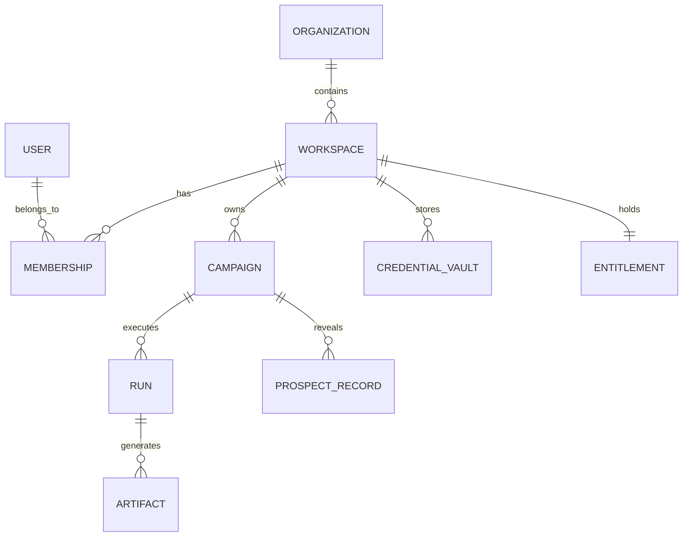

# Information Architecture (IA) Specification
**Document Type:** Information Architecture & Object Model  
**Project:** Prospect PAL Full-Stack GTM Automation Engine  
**Version:** v2.0.0-PROD  
**Status:** Approved  

---

## 1. Domain Object Model

### 1.1 Canonical Objects & Schema Definition

| Object | Purpose & Scope | Key Fields | Retention & Security Policy |
| :--- | :--- | :--- | :--- |
| **Organization** | Top-level enterprise tenant boundary | `id`, `name`, `billing_customer_id`, `created_at` | Immutable, multi-tenant Postgres RLS |
| **Workspace** | Environment for campaigns and integrations | `id`, `org_id`, `slug`, `region`, `settings` | Soft-delete with 30-day purge |
| **User** | Identity and authentication profile | `id`, `email`, `role`, `mfa_enabled`, `last_login` | PII protected, GDPR-compliant export |
| **Campaign** | Configured GTM outbound engine instance | `id`, `workspace_id`, `name`, `icp_spec`, `status` | Versioned history, audit logged |
| **Run** | Individual execution run of an agent/workflow | `id`, `campaign_id`, `stage`, `telemetry`, `runData` | 90-day active retention, archived to S3 |
| **Artifact** | Compiled output (.n8n.json, email-scripts.md) | `id`, `run_id`, `type`, `version`, `checksum`, `uri` | Immutable, cryptographic hash verified |
| **Credential Vault**| Encrypted external API keys & OAuth tokens | `id`, `workspace_id`, `provider`, `encrypted_payload` | AES-256-GCM envelope encrypted, no plain text |
| **Entitlement** | Paid plan tier and execution allowances | `id`, `workspace_id`, `plan`, `seats`, `monthly_runs` | Stripe webhook synchronized source of truth |

---

## 2. Navigation Grammar & User Hierarchy

### 2.1 Marketing / Logged-Out Surface
`Product` $\rightarrow$ `Solutions (SaaS, Agency, Enterprise)` $\rightarrow$ `Pricing` $\rightarrow$ `Live Demo` $\rightarrow$ `Academy` $\rightarrow$ `Login / Start Free`

### 2.2 App / Authenticated Dashboard Surface
- **Top Command Bar:** Workspace Selector · Global Search (Cmd+K) · Notifications · BYOK Status Badge · User Avatar & Billing
- **Primary Side Navigation:**
  1. **Home / Overview:** Pipeline metrics, active campaigns, recent agent runs, system health.
  2. **GTM Builder & Canvas:** Dual-pane interactive AI chat intake + 9-node live SVG/React Flow graph.
  3. **Campaign Studio:** Multi-angle PAS email copywriting lab & A/B testing matrix.
  4. **Signals Lead Finder:** Real-time tech stack scanner and hiring intent lead discovery.
  5. **Execution Analyst:** n8n error diagnostics, rate-limit monitors, and self-healing telemetry.
  6. **Sales Academy:** Cold calling scripts, objection handling frameworks, and sales enablement modules.
  7. **Integration Vault:** Self-hosted n8n instance bridge, Composio, HubSpot, Apollo, Smartlead.
  8. **Workspace Settings:** Team members, RBAC permissions, Billing portal, Audit logs, Danger Zone.
