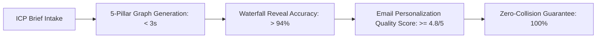

# Product Requirements Document (PRD) — Prospect PAL v2.0
**Document Type:** PRD  
**Project:** Prospect PAL Full-Stack GTM Automation Engine  
**Version:** v2.0.0-PROD  
**Status:** Approved  
**Owner:** Product & Architecture  
**Architecture Spec:** [Web App Development Process.md](file:///Users/patmini/prospect-pal/Web%20App%20Development%20Process.md)  
**Upstream:** [01-intent-spec.md](file:///Users/patmini/prospect-pal/docs/01-intent-spec.md), [02-jtbd.md](file:///Users/patmini/prospect-pal/docs/02-jtbd.md)  

---

## 1. Executive Summary & Market Opportunity

### 1.1 The Outbound Crisis
Modern B2B revenue teams face a fragmented, expensive outbound tech stack:
1. **Tool Sprawl & Fragility:** A typical outbound stack requires 5–8 disparate subscriptions (Apollo/Clay for data, ZeroBounce for verification, ChatGPT for ad-hoc copy, Smartlead/Instantly for sequencing, HubSpot/Salesforce for CRM). Integrations break weekly, causing lead leakage and dirty CRM data.
2. **Domain Reputation Destruction:** Spray-and-pray AI copy generates generic "slop" that triggers spam filters and destroys sender domain reputation within 30 days.
3. **High Human SDR Overhead:** Dedicated SDRs cost $75k–$100k/year fully loaded yet spend 70% of their day manually copying data, researching accounts, and personalizing first lines.
4. **CRM Collision Disasters:** Sales reps accidentally pitch existing active opportunities, churned accounts, or executive clients due to the lack of real-time CRM deduplication shields before email enrollment.

### 1.2 The Solution: Prospect PAL
Prospect PAL is an autonomous **Full-Stack GTM Automation Engine & Agent Platform** powered by the **ROSTR v2 Runtime**, **Vercel AI Suite**, and **Supabase**. It enables a single operator or revenue team to convert plain-English ICP briefs into production-grade, 5-pillar outbound workflows that discover, verify, research, personalize (PAS framework), and enroll high-value prospects with guaranteed zero-collision CRM safeguards.

---

## 2. Core Personas & Jobs-To-Be-Done (JTBD)

| Persona | Role & Context | Primary Trigger / Job | Success Metric |
| :--- | :--- | :--- | :--- |
| **Growth Founder / Solopreneur** | Seed to Series A founder managing sales solo | "When I launch my product, I want to automatically reach 50 qualified decision makers daily without hiring an agency." | First 10 booked discovery calls in <14 days; <$100/mo spend. |
| **VP of Sales / Head of RevOps** | B2B Scale-up (20–250 employees) | "When our pipeline stalls, I want to deploy multi-angle outbound workflows that protect our CRM integrity and domain reputation." | >35% open rate, >8% positive reply rate, 0% CRM lead collisions. |
| **GTM Agency Owner / Consultant** | Manages outbound for 10+ client workspaces | "When onboarding new clients, I want to generate client-tailored n8n/MCP workflows and copy variations in 5 minutes." | Time-to-campaign launch reduced from 3 days to 5 minutes. |
| **AI Systems Engineer / Operator** | Technical operator maintaining agent swarms | "When scaling automation, I want self-healing agent runs, full observability, and multi-provider LLM failover." | 99.9% workflow execution uptime; automated error triage. |

---

## 3. Product Scope & Functional Modules

### 3.1 V1 Scope (Production Foundation — Zero AWS Architecture)
- **ROSTR v2 Multi-Agent Swarm:** Dynamic loading of GTM Architect, CRM Dedupe Shield, Enably Copywriter, and Execution Analyst.
- **5-Pillar Outbound Compiler:**
  1. *Trigger & Ingest:* Automated ICP search cron or Webhook CSV intake.
  2. *Normalization & Dedupe:* Real-time CRM check (HubSpot, Salesforce, Pipedrive, Attio) to reject active accounts.
  3. *Waterfall Reveal & Verification:* Tiered data enrichment (Apollo, Clay, Prospeo, Dropcontact) with MX/SMTP bounce checks.
  4. *Deep Account PAS Research:* Multi-shot company web scraping, pain-point extraction, and 3-sentence Problem-Agitate-Solution email copywriting.
  5. *Sequencer Enrollment & Alert:* Smartlead/Instantly enrollment + Slack/Discord approval and review alerts.
- **Vercel AI Stack Chat & Visual Canvas:** Unified chat interface with streaming responses, tool call visualizations, and live React Flow / SVG graph rendering.
- **Artispreneur-Style Multi-Version Backend:** Clean isolation between Agent definitions, Versioned Runtimes (`v1`, `v2`, `canary`), Tool connectors, and Workspace Sandboxes.
- **BYOK & Multi-Provider AI Gateway:** Support for Anthropic, OpenAI, and Google Gemini with automatic failover routing.
- **Supabase Authentication & Stripe Payments:** Multi-tenant workspace RBAC (Owner, Admin, Member, Viewer) with Stripe checkout and subscription metering.

### 3.2 V1.1 & V2 Scope (Next / Later)
- **Voice Agent Handoff:** SignalWire conversational voice AI for inbound qualification and warm phone transfer.
- **Signals-Based Trigger Engine:** Real-time intent triggers (funding rounds, job postings, GitHub commits, tech stack installs).
- **Sub-Workflow Orchestration & Distributed Agents:** Multi-tenant Inngest / Vercel Workflow engine running distributed headless browser workers.

---

## 4. Key Performance Indicators (KPIs) & Target Metrics

1. **Time-to-Value (TTV):** From new user login to running outbound campaign in `< 3 minutes`.
2. **Compilation Latency:** End-to-end n8n JSON & script generation in `< 4 seconds`.
3. **Execution Reliability:** `> 99.9%` uptime with automated rate-limit backoff and circuit-breaking.
4. **Deliverability Benchmark:** Bounce rate `< 2.5%` across all verified emails.

---

## 5. Non-Goals (Out of Scope for V1)
- Building a custom proprietary email sending MTA (we integrate directly with Smartlead, Instantly, and HubSpot).
- Unbounded autonomous agent spend (all agent LLM runs enforce strict token and cost caps).
- Custom on-premise single-tenant deployments (cloud multi-tenant with BYOK only).
