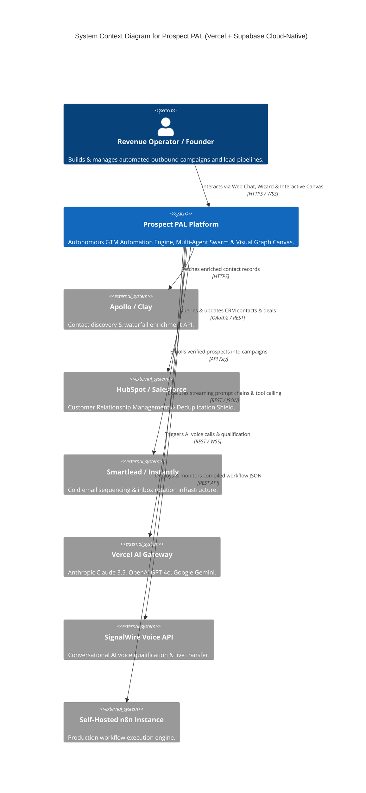
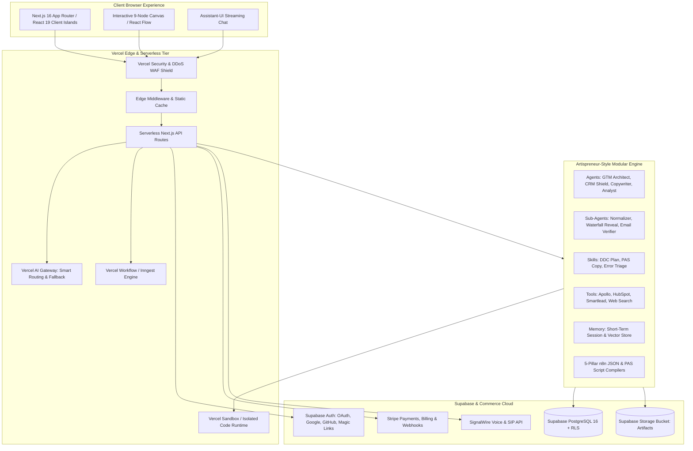
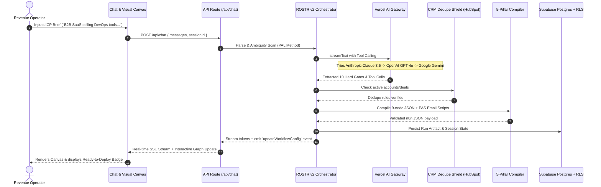

# System Architecture Document — Prospect PAL v2.0
**Document Type:** System Architecture & Topology Spec  
**Project:** Prospect PAL Full-Stack GTM Automation Engine  
**Version:** v2.0.0-PROD  
**Stack:** Vercel AI Suite · Supabase · Stripe · SignalWire · Next.js 16 · React 19  
**Specification:** [Web App Development Process.md](file:///Users/patmini/prospect-pal/Web%20App%20Development%20Process.md)  
**Status:** Approved  

---

## 1. C4 Architecture Models

### 1.1 Level 1: System Context Diagram



---

### 1.2 Level 2: Container Diagram



---

## 2. Sequence Diagrams

### 2.1 5-Pillar Campaign Compilation & Verification Sequence



---

## 3. Artispreneur-Style Architecture Design

The backend is strictly organized into decoupled, modular namespaces:

```
src/lib/
├── agents/                  # Autonomous Agents Directory
│   ├── gtm-architect.ts     # 5-Pillar compiler & graph architect
│   ├── crm-shield.ts        # Zero-collision CRM protection
│   ├── copywriter.ts        # 3-Sentence PAS email copywriter
│   └── execution-analyst.ts # n8n runData telemetry triage & fix agent
├── sub-agents/              # Delegated Sub-Agents for Task Splitting
│   ├── normalizer.ts        # Domain sanitization & name parsing
│   ├── waterfall-reveal.ts  # Multi-provider contact reveal (Apollo/Clay)
│   ├── email-verifier.ts    # MX record, SMTP handshake & bounce shield
│   └── sequencer-enroller.ts# Smartlead / Instantly campaign enrollment
├── skills/                  # Repeatable Execution Workflows
│   ├── ddc-plan/            # 11-stage campaign planning skill
│   ├── pas-copywriting/     # 3-sentence Problem-Agitate-Solution generator
│   └── error-triage/        # n8n execution telemetry diagnostic skill
├── tools/                   # Platform & Service Connectors (MCP)
│   ├── apollo.ts            # Apollo search & reveal connector
│   ├── hubspot.ts           # HubSpot CRM OAuth & dedupe connector
│   ├── smartlead.ts         # Smartlead campaign & lead connector
│   └── web-search.ts        # Live DuckDuckGo / Tavily research
├── functions/               # Atomic Tasks (Normalize, Hash, Validate)
├── knowledge/               # Static RAG Knowledge & Prompt Catalogs
├── memory/                  # Session & Ephemeral Context Management
├── instructions/            # Canonical System Prompts & Guardrails
├── harness/                 # Runtime Agent Harness Wiring
├── gateway/                 # Vercel AI Multi-Provider Failover Gateway
└── sandbox/                 # Secure Isolated Code Execution Environment
```
