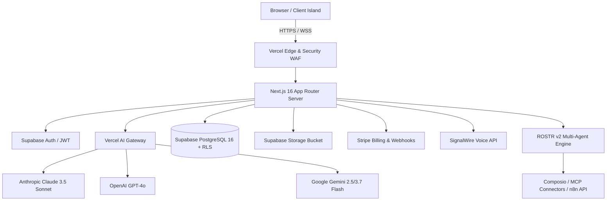

# Technical Stack Key Sheet & Architecture Decision Records (ADR)
**Document Type:** Technical Stack Specification & ADRs  
**Project:** Prospect PAL Full-Stack GTM Automation Engine  
**Version:** v2.0.0-PROD  
**Specification:** [Web App Development Process.md](file:///Users/patmini/prospect-pal/Web%20App%20Development%20Process.md)  
**Status:** Approved  

---

## 1. Complete Technical Stack Matrix (Zero AWS)

| Layer / Concern | Primary Selection | Alternatives Evaluated | Rationale |
| :--- | :--- | :--- | :--- |
| **Frontend Framework** | **Next.js 16 (App Router) + React 19** | Remix, Vite SPA, SvelteKit | Zero-cold-start React Server Components, optimal Core Web Vitals. |
| **Styling & Design System** | **Tailwind CSS v4 + Vanilla CSS Tokens** | Styled Components, Chakra | Pure White Premium aesthetic, tactile 60fps animations. |
| **Interactive Canvas** | **React Flow (`@xyflow/react`) + Custom SVG** | Cytoscape, D3.js | Lightweight, responsive node-graph visualization and drag-and-drop. |
| **AI LLM Orchestration** | **Vercel AI SDK Core (`ai` v7) + Vercel AI Gateway** | LangChain, Raw Bedrock SDK | Standardized streaming (`streamText`), tool calling, and zero single-provider outages. |
| **Database & Tenancy** | **PostgreSQL 16 (Supabase) + RLS** | DynamoDB, MongoDB, Aurora | True relational integrity, ACID transactions, and Row Level Security. |
| **Authentication** | **Supabase Auth (OAuth + Magic Links)** | AWS Cognito, Clerk, Auth0 | Seamless PostgreSQL RLS integration with zero user-management overhead. |
| **Object Storage** | **Supabase Storage** | AWS S3, Cloudflare R2 | Direct SQL-level access policies and built-in image transformations. |
| **Payments & Billing** | **Stripe Checkout & Billing Portal** | Paddle, LemonSqueezy | Industry gold-standard for subscriptions, usage metering, and PCI SAQ-A. |
| **Voice & Phone AI** | **SignalWire Voice API** | Twilio, Vonage | Ultra-low latency programmable SIP & AI voice qualification. |
| **Tool Integrations** | **Composio Core SDK + Native MCP Connectors** | Zapier Webhooks | Unified OAuth manager for Apollo, HubSpot, Salesforce, and Smartlead. |

---

## 2. Key Architecture Decision Records (ADRs)

### ADR-01: Full Elimination of AWS Infrastructure in Favor of Vercel + Supabase
- **Context:** AWS Bedrock, DynamoDB, and Cognito introduced brittle IAM authentication failures, token expirations, and complex multi-service configuration overhead.
- **Decision:** Standardize 100% on **Vercel AI Suite + Supabase + Stripe + SignalWire**.
- **Consequences:** 
  - *Positive:* Immediate elimination of AWS 403 authorization errors, simplified developer onboarding, instant local development, zero fixed idle server costs.
  - *Trade-off:* Managed platform dependency (mitigated by standard PostgreSQL and open-source Vercel AI SDK).

### ADR-02: Vercel AI Gateway Multi-Provider Resilient Auto-Failover
- **Context:** Single LLM provider dependencies lead to catastrophic downtime during outages or rate-limit spikes.
- **Decision:** Implement automatic multi-provider fallback in `src/lib/ai/index.ts`: `Anthropic Claude 3.5 Sonnet` $\rightarrow$ `OpenAI GPT-4o` $\rightarrow$ `Google Gemini`.
- **Consequences:** 99.99% LLM generation availability with BYOK (Bring Your Own Key) support.

### ADR-03: Artispreneur-Style Backend Modular Isolation
- **Context:** Multi-agent development requires clear boundaries between agent roles, skills, tools, and execution sandboxes.
- **Decision:** Structure the backend with strict sub-folder namespaces: `agents/`, `sub-agents/`, `skills/`, `tools/`, `functions/`, `knowledge/`, `memory/`, `instructions/`, `harness/`, `runtime/`, `gateway/`, and `sandbox/`.
