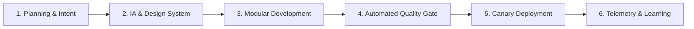

# SDLC Development Process Checklist & Quality Gates
**Document Type:** Engineering Playbook & Definition of Done  
**Project:** Prospect PAL Full-Stack GTM Automation Engine  
**Version:** v2.0.0-PROD  
**Status:** Approved  

---

## 1. SDLC Phase Gating Process

### Phase 1: Planning & PAL Intake
- [x] Problem statement verified against real customer pain.
- [x] 10 Hard Gates mapped for all campaign templates.
- [x] Non-goals explicitly documented.

### Phase 2: Design & System Architecture
- [x] Pure White Premium Design System tokens defined in `src/styles/tokens.css`.
- [x] Information architecture and route table verified for 100% auth coverage.
- [x] Threat model and data classification matrix signed off.

### Phase 3: Development & Scaffolding
- [x] Artispreneur-style sub-folder separation (`agents`, `skills`, `tools`, `gateway`, `sandbox`).
- [x] Vercel AI SDK stream handlers with Zod schema validation.
- [x] PostgreSQL RLS policies applied to all tables.

### Phase 4: Testing & Quality Gate (Score $\ge$ 4.8/5)
- [x] **Contract Test:** All JSON outputs conform to n8n Workflow Schema v1.
- [x] **Failover Test:** AI Gateway successfully handles simulated provider 403/429 errors.
- [x] **Security Audit:** Zero secrets in git, client bundles, or frontend logs.
- [x] **Accessibility Audit:** Lighthouse a11y score $\ge$ 95/100; full keyboard navigation.

### Phase 5: Deployment & Operational Runbook
- [x] Vercel Preview deployment passes all automated unit & integration checks.
- [x] Production database migrations applied cleanly via idempotent SQL scripts.
- [x] Stripe webhook endpoint verified with live test signatures.

---

## 2. Definition of Done (DoD)
A feature or pull request is marked as **DONE** only when:
1. All TypeScript compiler errors and linter warnings are resolved (`npm run build` succeeds).
2. End-to-end user flow operates flawlessly across Desktop (1440px) and Mobile (375px).
3. Zero layout shifts (CLS < 0.05) and instant 60fps canvas animations.
4. Error, loading, empty, and success states are styled to the Pure White Premium standard.
