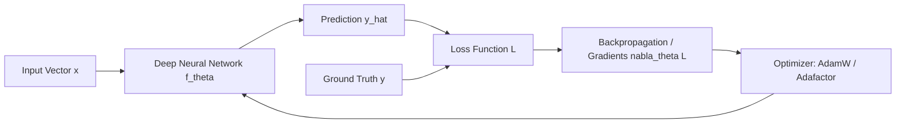
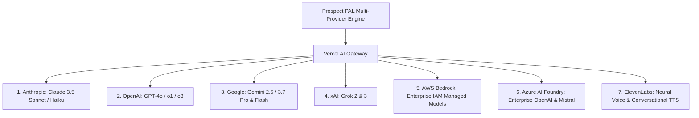

# Artificial Intelligence & Machine Learning Compendium: Foundations to Frontier Systems
**Document Type:** Educational Scholarly Compendium & Engineering Guide  
**Project:** Prospect PAL Full-Stack GTM Automation Engine  
**Version:** v2.0.0-PROD  
**Author:** AI Systems Architect & Research Lead  

---

## 1. Fundamentals of Machine Learning & Neural Computation

### 1.1 From Statistical Learning to Deep Neural Architectures
Machine Learning (ML) is the formal discipline of optimizing parameterized mapping functions $f_\theta: \mathcal{X} \rightarrow \mathcal{Y}$ from an input space $\mathcal{X}$ to an output space $\mathcal{Y}$ without explicit procedural programming.



1. **Forward Pass:** The input token sequence is projected into continuous embedding spaces, passed through stacked transformer blocks (linear projections, non-linear activation functions like SwiGLU/GeLU, and layer normalizations), producing output logits $\hat{y}$.
2. **Loss Computation:** For autoregressive causal language models, cross-entropy loss measures the divergence between the predicted probability distribution over the vocabulary and the actual ground truth next-token:
   $$\mathcal{L}_{CE} = -\sum_{i=1}^{V} y_i \log(\hat{y}_i)$$
3. **Backward Pass (Backpropagation):** The chain rule of calculus computes partial derivatives of the scalar loss with respect to every parameter in the network ($\nabla_\theta \mathcal{L}$).
4. **Optimization:** Optimizers like **AdamW** (Adaptive Moment Estimation with Decoupled Weight Decay) update weight matrices based on running first and second moments of the gradients.

### 1.2 The Transformer Architecture & Self-Attention
Introduced in *Vaswani et al. (2017)*, the Transformer replaced recurrence (RNNs/LSTMs) with **Scaled Dot-Product Attention**, allowing parallel computation across long sequences:

$$\text{Attention}(Q, K, V) = \text{softmax}\left(\frac{QK^T}{\sqrt{d_k}}\right)V$$

- **Queries ($Q$), Keys ($K$), Values ($V$):** Learned linear projections of token representations.
- **$\frac{QK^T}{\sqrt{d_k}}$:** Matrix of pairwise token similarity scores scaled by dimension square root to prevent vanishing softmax gradients.
- **Softmax:** Normalizes similarity weights into an attention probability distribution across the entire context window.

### 1.3 The 3-Stage Training Paradigm
```
[ 1. Pre-Training (Self-Supervised) ]  --> Huge text corpora (Trillions of tokens) -> Base Foundation Model
                 ↓
[ 2. Supervised Fine-Tuning (SFT) ]    --> Curated prompt-response pairs -> Instruction-Following Model
                 ↓
[ 3. Preference Alignment (RLHF / DPO)]--> Human feedback / Direct Preference Optimization -> Helpful & Harmless Agent
```

---

## 2. Hardware Compute, GPUs & Infrastructure Mechanics

### 2.1 Why GPUs Dominate Modern AI
CPUs excel at complex, low-latency, sequential logic with deep caches (4–128 cores). In contrast, **GPUs (Graphics Processing Units)** are massively parallel throughput machines containing thousands of compact Arithmetic Logic Units (ALUs) and dedicated **Tensor Cores** optimized for dense matrix-matrix multiplication (GEMM: $C = A \cdot B + C$).

| Specification / Metric | NVIDIA H100 SXM5 | NVIDIA B200 (Blackwell) | Typical Modern Server CPU |
| :--- | :--- | :--- | :--- |
| **FP16 / BF16 Tensor TFLOPS** | ~2,000 TFLOPS | ~4,500 TFLOPS | < 10 TFLOPS |
| **FP8 Tensor TFLOPS** | ~4,000 TFLOPS | ~9,000 TFLOPS | N/A |
| **High Bandwidth Memory (HBM)** | 80 GB HBM3 | 192 GB HBM3e | 512 GB–2 TB DDR5 (High Latency) |
| **Memory Bandwidth** | 3.35 TB/s | 8.0 TB/s | ~300 GB/s |
| **Interconnect Speed (NVLink)**| 900 GB/s bidirectional | 1.8 TB/s bidirectional | PCIe Gen 5 (~128 GB/s) |

### 2.2 Memory Bottlenecks & KV-Caching
- **Parameter Footprint:** In FP16 precision, every parameter requires 2 bytes. A 70-billion parameter model requires $70 \times 2 = 140\text{ GB}$ of VRAM just to store the static weights (requiring at least two 80GB H100 GPUs).
- **KV-Cache (Key-Value Cache):** During inference generation, previously computed Keys and Values for past tokens are cached in VRAM so the attention mechanism does not re-compute the entire history for every newly generated token.
- **Quantization (INT8 / FP8 / INT4 / AWQ):** Compressing weights from 16-bit to 8-bit or 4-bit reduces VRAM requirements by 50–75% with minimal perceptual loss in reasoning quality.

---

## 3. Tokenomics & Linguistic Representation

### 3.1 Sub-Word Tokenization
LLMs do not process raw ASCII or UTF-8 characters directly; they operate on discrete integer IDs corresponding to sub-word units generated by algorithms like **Byte-Pair Encoding (BPE)** or **SentencePiece**.
- Rule of thumb: **1,000 tokens $\approx$ 750 English words** ($\approx 4$ characters per token).
- Code, structured JSON, and specialized symbols often tokenize at higher ratios (1 token per 2–3 characters).

### 3.2 Frontier Pricing & Context Economics (Per 1 Million Tokens)

| Model & Provider | Input Tokens (per 1M) | Output Tokens (per 1M) | Context Window | Best Suited For |
| :--- | :--- | :--- | :--- | :--- |
| **Claude 3.5 Sonnet (Anthropic)** | $3.00 | $15.00 | 200,000 tokens | Complex code, agentic tool-use, high taste GTM copy |
| **Claude 3.5 Haiku (Anthropic)** | $0.80 | $4.00 | 200,000 tokens | Low-latency classification, quick routing, parsing |
| **GPT-4o (OpenAI)** | $2.50 | $10.00 | 128,000 tokens | Multimodal vision, general reasoning, broad tools |
| **GPT-4o-mini (OpenAI)** | $0.15 | $0.60 | 128,000 tokens | High-volume dedupe, normalization, fast triage |
| **Gemini 2.5/3.7 Flash (Google)** | $0.075 | $0.30 | 1,000,000+ tokens | Ultra-long context ingestion, cost-optimized pipelines |
| **Grok 2 / 3 (xAI)** | Competitive | Competitive | 128,000 tokens | Real-time social intent & uncensored reasoning |
| **ElevenLabs (Voice AI)** | ~$0.15–$0.30 / 1k chars | Audio Output | N/A | Human-indistinguishable conversational voice agents |

---

## 4. Frontier Model Provider Ecosystem



1. **Anthropic (Claude Family):** The gold standard for agentic coding, nuanced reasoning, tool adherence, and prompt reliability.
2. **OpenAI (GPT & Reasoning Series):** Market leader with massive ecosystem support, structured outputs (`response_format: json_schema`), and frontier reasoning models ($o1$, $o3$).
3. **Google DeepMind (Gemini Family):** Unmatched native multi-modality (audio, video, text) and industry-leading million-token context windows with lowest pricing tiers.
4. **xAI (Grok Family):** High compute velocity trained on Colossus (100k+ H100 cluster), strong mathematical reasoning and real-time social context.
5. **AWS Bedrock:** Enterprise cloud wrapper providing HIPAA/SOC2-compliant managed endpoints for Claude, Llama 3, and Mistral using AWS IAM governance.
6. **Azure AI Foundry:** Microsoft's enterprise AI hub offering enterprise SLA-backed GPT models, content safety filters, and fine-tuning suites.
7. **ElevenLabs:** Frontier voice synthesis featuring ultra-low latency streaming TTS, voice cloning, and bidirectional conversational voice agents.

---

## 5. Modern AI Engineering Paradigms

### 5.1 Vibe Coding
**Vibe Coding** is the modern software engineering paradigm where human engineers operate as high-level **Architects, Curators, and Directors** while Autonomous AI Coding Harnesses generate, refactor, and verify production codebases. Instead of writing boilerplate syntax, the developer articulates intent, enforces architectural taste, establishes strict boundary constraints, and validates system behavior.

### 5.2 Chain Prompting & Context Engineering
- **Chain Prompting:** Decomposing complex tasks into sequential LLM calls where the validated structured output of Stage $N$ becomes the explicit prompt context for Stage $N+1$.
- **Context Engineering:** The art and science of providing maximal relevant context (domain models, design systems, error logs, few-shot examples) within the prompt without exceeding KV-cache efficiency thresholds.

### 5.3 Agent Harnesses, Loop Engineering & Graph Systems
- **Agent Harness:** The runtime scaffolding that connects an LLM to stateful memory, tool execution environments, and permission policies.
- **Loop Engineering:** Autonomous convergence loops where an agent continues executing, verifying, and self-correcting until an explicit checklist or quality gate evaluates to $\text{Score} \ge \text{Target}$.
- **Graph-Based Execution (DAGs):** Structuring agent workflows as Directed Acyclic Graphs (DAGs) where execution branches can run in parallel (e.g. researching company web data while simultaneously querying CRM dedupe records) before joining for final compilation.

---

## 6. Coding Harnesses & Cloud Infrastructure Matrix

### 6.1 Coding Harnesses
- **AntiGravity / Cursor / Windsurf / Cline / Codex / Claude Code / HyperAgent:** Frontier agentic IDEs and command-line coding harnesses with deep workspace AST indexing, multi-file diff editing, and automated terminal execution.
- **v0.dev / Lovable / Figma Make:** Generative UI canvases that convert conversational prompts and design tokens into React/Tailwind frontend code.

### 6.2 Cloud Hosting & Compute Platforms
- **AWS (Amazon Web Services):** Scalable enterprise compute (ECS/Fargate, Lambda, S3, DynamoDB, RDS, Bedrock).
- **Vercel:** Optimized frontend edge hosting, Serverless Route Handlers, Edge Middleware, and AI SDK acceleration.
- **Google Cloud Platform (GCP):** Cloud Run, BigQuery, Vertex AI, and managed Kubernetes (GKE).
- **Supabase / DigitalOcean / Heroku:** Rapid-deployment managed PostgreSQL, real-time subscriptions, and VPS compute instances.
