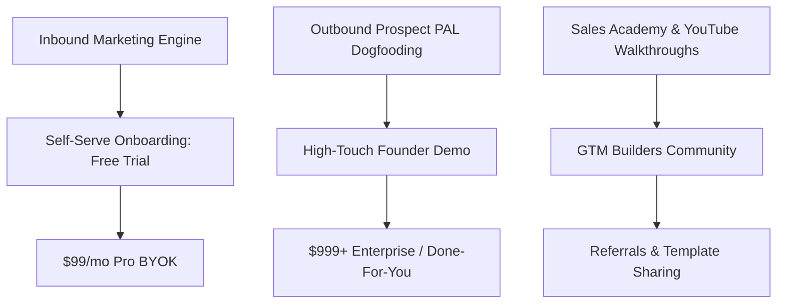

# Go-To-Market (GTM) Master Strategy & Sales Playbook
**Document Type:** Go-To-Market Strategy & Execution Blueprint  
**Project:** Prospect PAL Full-Stack GTM Automation Engine  
**Version:** v2.0.0-PROD  
**Status:** Approved  

---

## 1. Executive GTM Strategy & Target Segments

### 1.1 Target Market Tiers

| Segment | Target Profile | Value Proposition | Primary Pricing Tier |
| :--- | :--- | :--- | :--- |
| **Tier 1: Solo Founders & Early Teams** | 1–10 employees, Seed / Bootstrapped | "Deploy a world-class outbound engine in 5 minutes with zero technical debt." | **$99/mo Pro (BYOK)** |
| **Tier 2: Growth Stage B2B SaaS** | 10–100 employees, Series A–B | "Eliminate CRM collisions, automate PAS email personalization, and scale pipeline." | **$299/mo Growth** |
| **Tier 3: GTM Agencies & Outbound Consultants** | Managing 5–50 client accounts | "White-label n8n workflows, multi-workspace client orchestration, and instant campaign generation." | **$999/mo Enterprise** |

---

## 2. Marketing Channels & Acquisition Funnel

### 2.1 Organic & Content Channels
1. **Dogfooding Outbound Campaigns:** Prospect PAL uses its own 5-pillar automation engine to discover and engage RevOps leaders, VPs of Sales, and B2B Founders on LinkedIn and cold email.
2. **Sales Academy & Interactive Playbooks:** In-depth educational teardowns of high-converting PAS cold emails, objection handling matrices, and sales scripts.
3. **Interactive ROI & Outbound Simulator:** Public calculator on `/home` showing revenue gained vs. human SDR hire costs.

### 2.2 Product-Led Growth (PLG) Loops
- **Free Workflow Export:** Visitors can build and preview their custom 9-node n8n graph for free. Exporting ready-to-deploy `.n8n.json` and email scripts unlocks with a free account.
- **Pre-Built Template Hub:** Shareable GTM campaign templates (e.g. "Fintech Series A Hiring", "DevOps Cloud Migration", "Cybersecurity CISO Outreach").

---

## 3. High-Converting Sales Playbook & Cold Outreach Scripts

### 3.1 3-Sentence PAS Email Framework (Problem · Agitate · Solution)

#### Template 1: The CRM Collision & Domain Health Angle
> **Subject:** quick question on {{company_name}}'s outbound deliverability  
> **Hi {{first_name}},** saw your team is ramping sales hiring on LinkedIn—most revenue leaders tell us their reps are spending 3+ hours a day manually researching accounts and accidentally emailing active CRM deals.  
> We built an autonomous GTM engine that auto-dedupes against your CRM and generates 3-sentence verified PAS emails directly into Smartlead.  
> Open to seeing a 2-minute video of how we automated this for 50+ B2B teams?  
> **Best,**  
> {{sender_name}}

#### Template 2: The SDR Velocity & Pipeline Acceleration Angle
> **Subject:** 30% faster pipeline for {{company_name}}  
> **Hi {{first_name}},** noticed {{company_name}} recently rolled out {{product_feature}}—scaling outbound usually breaks when reps send generic AI slop that burns your domain reputation.  
> Prospect PAL builds 5-pillar n8n workflows with verified Apollo waterfalls and custom account pain-point research in under 3 minutes.  
> Worth a quick glance at your custom workflow graph?  
> **Best,**  
> {{sender_name}}

---

## 4. Sales Enablement: 80/20 Cold Calling Script & Objection Matrix

### 4.1 80/20 Cold Call Structure
- **Pattern Interrupt (0–7s):** *"Hi {{first_name}}, this is {{sender_name}} with Prospect PAL—I know you weren't expecting my call. Do you have 27 seconds to hear why I called, and if it makes zero sense, you can hang up on me?"*
- **The Problem Hook (8–20s):** *"We work with VPs of Sales who are tired of paying $80k for SDRs who spend all day copying and pasting from Apollo into spreadsheets while burning company email domains."*
- **The Solution Offer (21–35s):** *"We automated the entire 5-pillar workflow into a self-healing agent that discovers, verifies, and enrolls prospects with zero CRM collisions. Would you be opposed to seeing a 3-minute demo later this week?"*

### 4.2 Objection Handling

| Objection | Framework | High-Converting Response |
| :--- | :--- | :--- |
| *"We already use Apollo / Clay."* | Acknowledge & Elevate | *"Apollo and Clay are fantastic for raw data, but they don't automatically dedupe against your active CRM deals, write custom PAS copy, and self-heal failed runs. We sit right on top of them as the autonomous orchestration layer."* |
| *"We don't do cold outreach."* | Reframe | *"Completely understand. Most of our founders said the same until they realized our zero-collision shield only targets high-intent in-market accounts without spamming. Would it hurt to see the workflow?"* |
| *"Send me an email first."* | Low-Friction Close | *"Will do right now. To make sure I send only what's relevant, are you using HubSpot or Salesforce for your CRM?"* |
